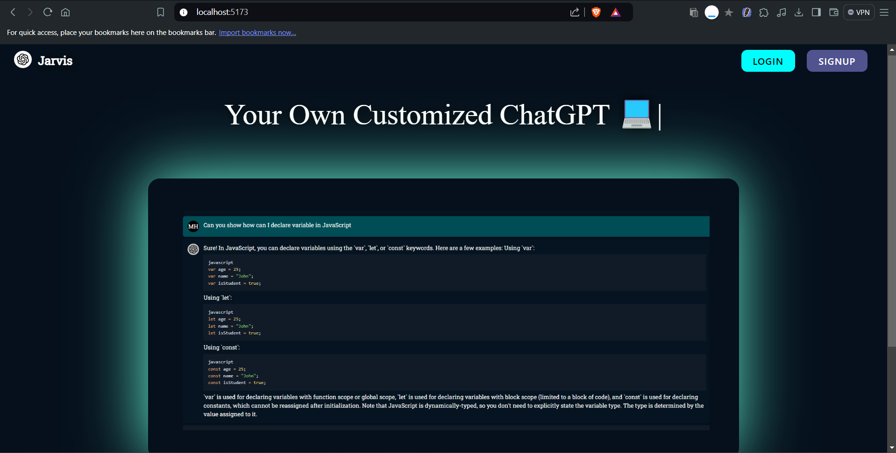
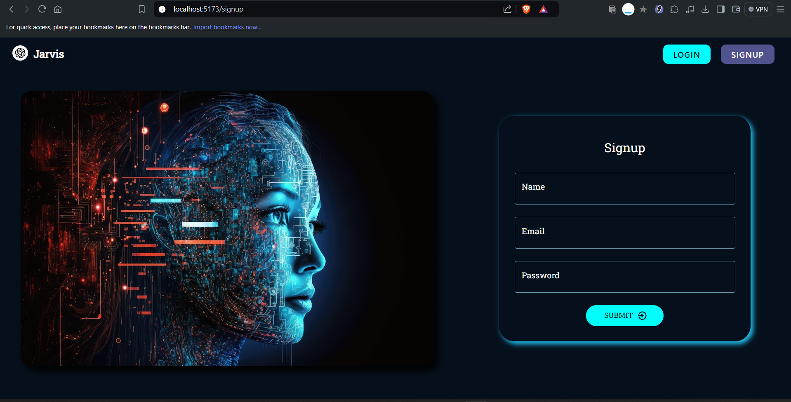
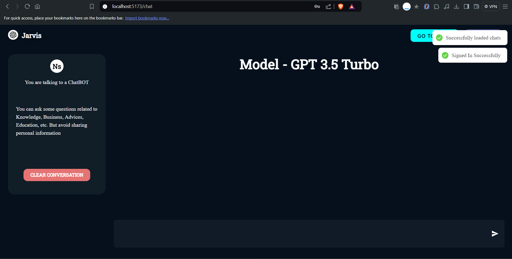
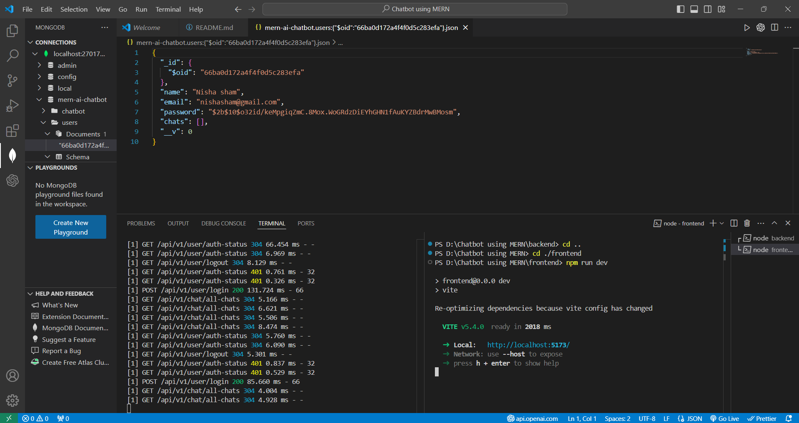

# **MERN AI Chatbot**

This is a full-stack AI Chatbot application built using the MERN stack. The frontend is developed with React.js, and the backend is powered by Node.js. The application allows users to sign up, log in, and interact with an AI-powered chatbot.

## **Table of Contents**
- [Features](#features)
- [Screenshots](#screenshots)
- [Installation](#installation)
- [Usage](#usage)
- [Technologies Used](#technologies-used)
- [Database](#database)
- [Contributing](#contributing)
- [License](#license)

## **Features**
- User Authentication (Sign Up & Login)
- AI Chatbot for user interaction
- Responsive design
- MongoDB for data storage

## **Screenshots**

### 1. Home Page

*The main landing page of the AI Chatbot application.*

### 2. Login & Sign Up Page

*The page where users can log in or sign up to access the chatbot.*

### 3. AI Chatbot Page

*The interactive AI Chatbot interface where users can chat with the AI.*

### 4. Database Storage

*An overview of where the user data and chat logs are stored in MongoDB.*

## **Installation**

1. Clone the repository:

   \`\`\`bash
   git clone https://github.com/nandiniagrawal2003/mern-ai-chatbot.git
   cd mern-ai-chatbot
   \`\`\`

2. Navigate to the backend directory and install the required dependencies:

   \`\`\`bash
   cd ./backend
   
   npm install
   \`\`\`

4. Navigate to the frontend directory and install the required dependencies:

   \`\`\`bash
   cd ./frontend
   npm install
   \`\`\`

## **Usage**

1. Start the backend server:

   \`\`\`bash
   cd backend
   npm run dev
   \`\`\`

   The backend will run on \`http://localhost:5000\`.

2. In a new terminal, start the frontend server:

   \`\`\`bash
   cd frontend
   npm run dev
   \`\`\`

   The frontend will run on \`http://localhost:5173\`.

3. Open your browser and go to \`http://localhost:5173\` to view the application.

## **Technologies Used**

- **Frontend**: React.js
- **Backend**: Node.js, Express.js
- **Database**: MongoDB
- **API**: Open AI 

## **Database**

The application uses MongoDB to store user data and chat logs. Ensure that your MongoDB service is running and properly configured in your backend.

## **Contributing**

Contributions are welcome! Please fork the repository and create a pull request with your changes.

## **License**

This project is licensed under the MIT License - see the [LICENSE](LICENSE) file for details.
